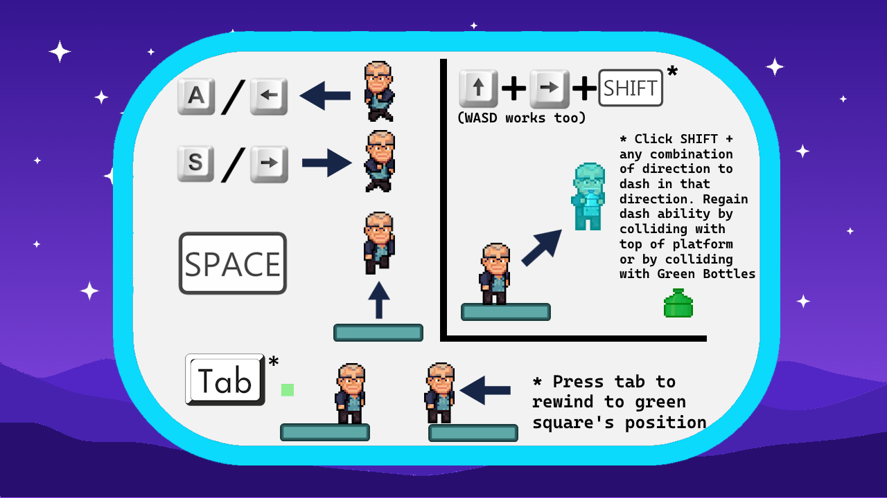

# Andrieste

**Andrieste** is a 2D platformer inspired by *Celeste*.  
It features **5 custom-built levels** and **3 modes of random level generation**.

The game was developed as my final project for CS15 at Brown University.

---

## How to Play

### Requirements
- Java (JDK installed)

### Run the Game

1. Install Java if you don’t already have it.
   
3. Open a terminal in the project folder.
   
4. Compile the source files:
   ```bash
   javac *.java
   ```
5. Run the game:
   ```bash
   cd ..
   java andrieste.App
   ```

## Gameplay

[](https://www.youtube.com/watch?v=Qe5eLSNBbMg)

## Controls


